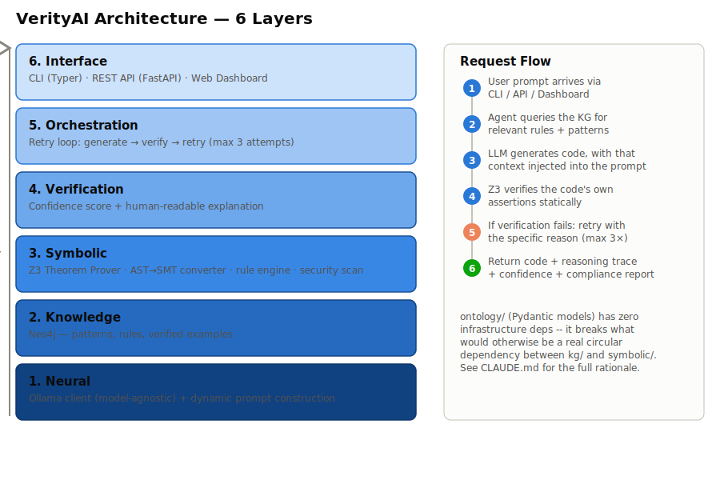

# VerityAI

Neuro-symbolic code verification: **LLM-generated code + formal proofs + explainability**.

<!--
Once this repo is pushed to GitHub, replace OWNER/REPO below to activate
these badges (they currently point nowhere on purpose -- a badge pointing
at a URL that doesn't exist yet would be worse than no badge).
-->
[](https://github.com/OWNER/REPO/actions/workflows/ci.yml)
[](LICENSE)
[](pyproject.toml)

## Problem Statement

Enterprises don't trust AI-generated code because they can't see **why** it's correct.

VerityAI addresses this with a neuro-symbolic pipeline:
1. **Generate** — an LLM produces code, with Knowledge Graph rules/patterns injected into the prompt (no fine-tuning)
2. **Verify** — Z3 Theorem Prover checks the code's own assertions for internal consistency, within a deliberately-scoped verifiable subset (see [`docs/VERIFICATION_SCOPE.md`](docs/VERIFICATION_SCOPE.md) for exactly what does/doesn't verify, with worked examples, and [ADR-0001](docs/adr/0001-verifiable-python-subset.md) for the original scope decision)
3. **Retry** — up to 3 attempts, with the specific verification failure fed back into the next prompt
4. **Explain** — a human-readable reasoning trace + weighted confidence score, exportable as a compliance report (PDF/SARIF)

Result: code that comes with a formal proof of what was actually checked, not just a claim that it works.

**Model-agnostic by design**: the LLM layer (`neural/ollama_client.py`) talks to any Ollama-served model. This repo defaults to `llama3.2` (small, fully local, no download required beyond the base image) and the evaluation harness is built to cross-check results across multiple models (e.g. `llama3.2` vs `qwen3:8b`) rather than being tuned to one. See [`docs/PHASE_3_METHODOLOGY.md`](docs/PHASE_3_METHODOLOGY.md) for what's actually been measured, model by model, including where results were *not* what the architecture predicted.

## Honest Limitations

This project is built and documented with the same rigor it asks of the code it verifies — including admitting where it falls short:

- **The verifiable subset is intentionally narrow.** Z3 checks work over `int`/`bool`/`float`, `if`/`else` (with correct phi-merging), bounded `for` loops (as "one arbitrary iteration," not full induction), function parameters (validity-checked per [ADR-0002](docs/adr/0002-parameterized-verification.md)), and `assert`/docstring `PRE:` contracts. It does **not** cover strings, real list/dict operations, recursion, or exceptions — code using those degrades explicitly to `NOT_VERIFIED`, never a silent false pass.
- **No code-execution sandbox yet.** `symbolic/security_scan.py` is a static AST blocklist (blocks `os.system`, `eval`, `subprocess`, `pickle.loads`, etc.) — it does not run generated code in an isolated environment, so it can be evaded by patterns not on the list. See `docs/PHASE_4_PART_D.md`.
- **Real bugs were found, not just theoretical ones.** A live run against `llama3.2` crashed the orchestrator on malformed generated code (fixed — see `docs/PHASE_3_METHODOLOGY.md`'s "Real run #1"), and the retry loop underperformed single-shot verification in that same run. Both are documented as open questions, not swept under the rug.
- **The evaluation's ground-truth mechanism has a known gap** (exact-string matching against a live model's output rarely succeeds) — actively being replaced with an execution-based oracle; see `docs/PHASE_3_METHODOLOGY.md`.

## Quick Start

### Prerequisites
- Docker + Docker Compose
- Python 3.9+ (developed and tested primarily on 3.9; CI also runs 3.11)
- [Ollama](https://ollama.com) installed locally, or use the `ollama` service in `docker/docker-compose.yml`

### 1. Start services

```bash
cp .env.example .env
docker compose -f docker/docker-compose.yml up -d
docker compose -f docker/docker-compose.yml ps   # wait for all services healthy

# Pull a model (llama3.2 is small and fast; swap for any Ollama model)
docker compose -f docker/docker-compose.yml exec ollama ollama pull llama3.2
```

### 2. Install

```bash
pip install -e ".[dev]"
pre-commit install   # optional but recommended
```

### 3. Verify the setup

```bash
make test        # full test suite (421 tests, offline/faked by default)
make lint         # ruff check + format check
make typecheck    # mypy
```

### 4. Try it

```bash
# CLI: generate + verify against a live Ollama instance
verityai generate "write a function that returns the max of two numbers"

# CLI: verify a file you already have, no LLM involved
verityai verify path/to/file.py

# API: run the FastAPI server
make serve
# then: curl localhost:8000/health, or open localhost:8000/dashboard
```

## Architecture

Six layers, each depending only on the ones below it (`ontology/` has zero infrastructure dependencies, breaking what would otherwise be a KG ↔ Symbolic circular dependency — see `CLAUDE.md` for the full rationale):



<details>
<summary>Plain-text fallback</summary>

```
┌─────────────────────────────────────────────────────┐
│ 6. INTERFACE      CLI · REST API · Web Dashboard     │
├─────────────────────────────────────────────────────┤
│ 5. ORCHESTRATION  Retry loop (generate→verify→retry) │
├─────────────────────────────────────────────────────┤
│ 4. VERIFICATION   Confidence score + explanation     │
├─────────────────────────────────────────────────────┤
│ 3. SYMBOLIC       Z3 + AST→SMT converter + rules     │
├─────────────────────────────────────────────────────┤
│ 2. KNOWLEDGE      Neo4j (patterns, rules, examples)  │
├─────────────────────────────────────────────────────┤
│ 1. NEURAL         Ollama client + prompt builder     │
└─────────────────────────────────────────────────────┘
```

</details>

**Request flow**: user prompt → Agent queries the KG for relevant rules/patterns → LLM generates code with that context injected → Z3 statically verifies the code's own assertions → on failure, the specific reason is fed back into a retry (max 3) → final code + full reasoning trace + confidence score, exportable as a compliance report.

Full architecture documentation, module dependency graph, and key design decisions: [`CLAUDE.md`](CLAUDE.md).

## Project Structure

```
VerityAI/
├── src/verityai/
│   ├── ontology/        # Pydantic models — zero infrastructure deps
│   ├── neural/          # Ollama client + prompt construction
│   ├── kg/               # Neo4j client + seed data ingestion
│   ├── symbolic/        # AST→Z3 converter, rule engine, security scanner
│   ├── agent/            # Orchestrator (retry loop), sessions, continuous learning
│   ├── evaluation/      # Baseline comparison harness + benchmarks + dashboard
│   ├── compliance/      # PDF/SARIF report generation, audit log
│   ├── api/              # FastAPI (REST + web dashboard + rate limiting)
│   ├── cli/              # Typer CLI
│   ├── sdk.py            # `from verityai import Verifier`
│   └── db/               # Shared SQLAlchemy declarative base
├── tests/                # 421 tests: unit + integration, offline by default
├── docs/                 # Phase reviews, methodology, ADRs
├── docker/                # docker-compose.yml (Neo4j, Postgres, Redis, Ollama, API)
└── scripts/               # Phase 0 setup validation, seed data ingestion
```

## Development

```bash
make test          # pytest tests/ --cov=verityai --cov-fail-under=85
make lint           # ruff check + ruff format --check
make typecheck      # mypy src/verityai
make docker-build   # docker build -t verityai:latest .
make serve          # uvicorn verityai.api.rest:app --reload
```

`pre-commit install` runs ruff + mypy + basic hygiene checks (trailing whitespace, large files, merge conflicts) on every commit — the same checks CI runs in `.github/workflows/ci.yml`.

## Key Design Decisions

1. **No fine-tuning** — rules injected as dynamic prompt context, so rule updates don't require retraining.
2. **Single package, not five** — a neutral `ontology/` module breaks what would otherwise be a real circular dependency between `kg/` and `symbolic/`.
3. **Verifiable Python subset, defined upfront** (ADR-0001) — code outside the subset degrades explicitly to `NOT_VERIFIED`, never a silent pass.
4. **Walking skeleton first** — one algorithm + three rules built end-to-end before scaling seed data, so the shape of the system is validated before its size.
5. **Continuous Learning + Interactive Refinement + Compliance Reports** built in, not bolted on later — see `CLAUDE.md`'s "Integrated Improvements."

Full rationale: [`CLAUDE.md`](CLAUDE.md).

## Status

All 4 phases of the original build plan are complete (Foundation → Core Infrastructure → Agentic Loop → Productization), followed by a portfolio-hardening pass (CI, type-checking, an execution-based evaluation oracle, and the honest accounting above). See `docs/PHASE_*.md` for a phase-by-phase record of what shipped, what was found along the way, and what's still open.

## Docker Compose Services

```
neo4j       localhost:7687   Knowledge Graph
postgres    localhost:5432   Trace storage, audit logs
redis       localhost:6379   Caching, sessions
ollama      localhost:11434  LLM inference
app         localhost:8000   VerityAI API + dashboard (verityai:latest)
```

```bash
docker compose -f docker/docker-compose.yml logs -f <service>
docker compose -f docker/docker-compose.yml down
```

## Troubleshooting

**Ollama not responding**
```bash
docker compose -f docker/docker-compose.yml ps ollama
docker compose -f docker/docker-compose.yml logs ollama
docker compose -f docker/docker-compose.yml exec ollama ollama pull llama3.2
```

**Neo4j won't connect** — check the container is healthy (`docker compose ps neo4j`); if data looks corrupted, `docker compose down` and remove the `neo4j_data` volume before recreating.

**Import errors** — `pip install -e ".[dev]"` again; the package is installed in editable mode so `src/verityai` changes take effect immediately.

## Contributing

1. `git checkout -b feature/xyz`
2. Write code + tests (`make test` should stay green, coverage ≥ 85%)
3. `make lint && make typecheck`
4. `git commit` (pre-commit hooks run automatically if installed)
5. Open a PR

## References

- Architecture: [`CLAUDE.md`](CLAUDE.md)
- Verification scope reference (what verifies vs. not, with examples): [`docs/VERIFICATION_SCOPE.md`](docs/VERIFICATION_SCOPE.md)
- Verifiable subset scope decision: [`docs/adr/0001-verifiable-python-subset.md`](docs/adr/0001-verifiable-python-subset.md)
- Parameterized verification: [`docs/adr/0002-parameterized-verification.md`](docs/adr/0002-parameterized-verification.md)
- Evaluation methodology + real-run findings: [`docs/PHASE_3_METHODOLOGY.md`](docs/PHASE_3_METHODOLOGY.md)
- What testing against a real model actually found: [`docs/CASE_STUDY.md`](docs/CASE_STUDY.md)
- Phase-by-phase build record: `docs/PHASE_*.md`

## License

MIT — see [`LICENSE`](LICENSE).

## Contact

Juan Pablo Botero Espinosa
juanpabloboteroespinosa@gmail.com
